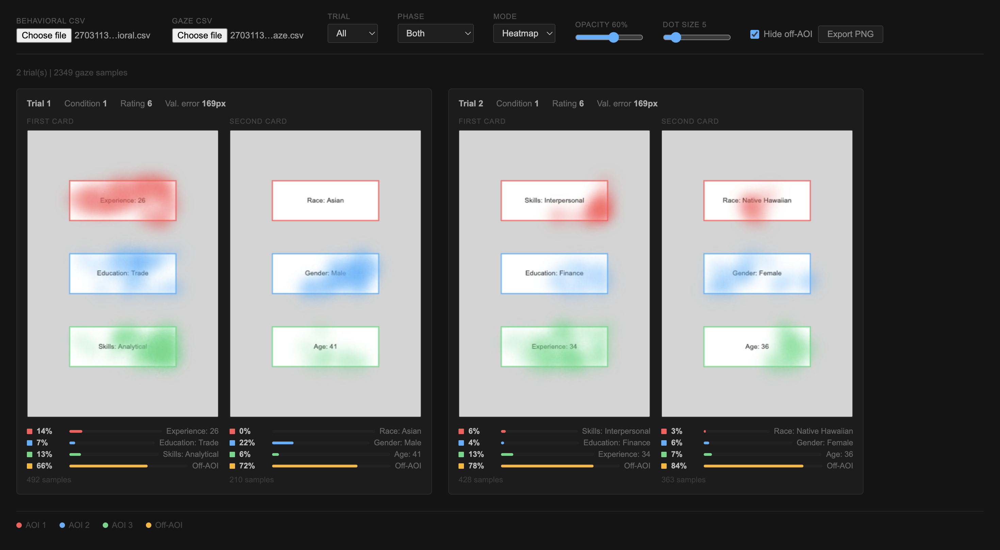

# Immoral Attention (Online)

Browser-based eye-tracking experiment using [WebGazer.js](https://webgazer.cs.brown.edu/). Participants evaluate fictional job candidates and optionally request additional information. Gaze is recorded throughout to measure attention allocation across performance attributes (education, experience, skills) and demographic attributes (race, age, gender).

Online port of a lab-based PsychoPy + EyeLink paradigm. Trial structure and stimulus generation match the lab version; calibration and gaze tracking run through the webcam instead of dedicated hardware.

## Trial flow

1. Setup checks (desktop, screen size, webcam)
2. Consent
3. Participant info (ID, age, gender)
4. 9-point click calibration, then 5-point passive validation
5. Trials:
   - Fixation cross (0.5--1 s)
   - Card with 3 candidate attributes
   - Optional second card with 3 more attributes
   - Rating (1--10)
6. Data download (behavioral CSV + gaze CSV)

Condition assignment is between-subjects by participant ID: even IDs see performance info first, odd IDs see demographic info first.

## Running locally

WebGazer requires the page to be served, not opened as a file. Start a local server and open in Chrome:

```
cd src/web
python3 -m http.server 8000
```

Then visit `http://localhost:8000`.

## Visualisation tool

`src/web/visualise/` is a standalone page for inspecting collected data. Open it in any browser, drop in the behavioral and gaze CSVs, and it renders gaze overlays on the stimulus cards with per-AOI dwell percentages, first-fixation markers, and a temporal timeline.



Example test data is available in `examples/test-data/`.

## Output

**Behavioral CSV** (one row per trial): condition, stimuli, AOI attribute labels, AOI bounding rectangles (px), per-AOI gaze count and percentage, rating, validation error.

**Gaze CSV** (one row per sample): trial, phase, x/y coordinates, timestamp, AOI hit, viewport dimensions.

## Dependencies

- [WebGazer.js](https://webgazer.cs.brown.edu/) (bundled in `src/web/lib/`)
- MediaPipe Face Mesh (bundled in `src/web/mediapipe/`)

Nothing to install.
